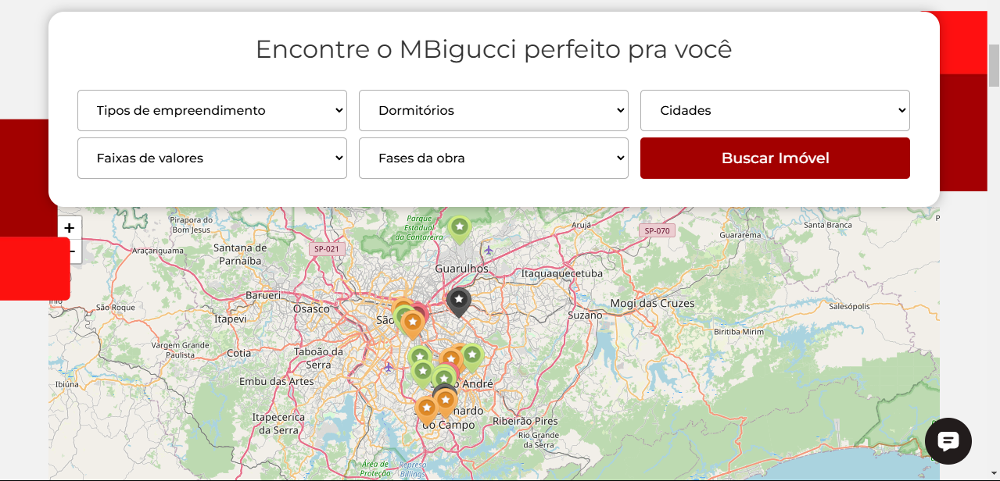

# Desafio AM Fernandes Front

## Descrição da Atividade

Nessa etapa, o candidato deverá realizar um estudo sobre UI (Interface do Usuário) e UX (Experiência do Usuário) de uma incorporadora que atua no ABC Paulista,
assim como a AM Fernandes. Com base no estudo, o candidato deverá:

### Escolher uma das empresas listadas para a realização do estudo:

- MBigucci (https://www.mbigucci.com.br) é o objeto de estudo escolhido.

### Realizar uma análise detalhada do site escolhido, elencando:

- Três pontos positivos da interface/experiência do site.

- Três pontos negativos da interface/experiência do site.

Buscando satisfazer os dois pontos elencados, identifca-se como **ponto positivo**: o (1) filtro avançado das unidades; (2) o mapa iterativo com a localização das unidades e pontos relevantes como mercados, postos de gasolina, pontos de ônibus, áreas verder e outros; (3) recomendação de unidades baseado em filtros específicos que visam atender as necessidades de famílias com filhos, _petlovers_, melhor idade, entre outros. Os **pontos negativos** identificados são: (1) carrossel que aumenta de tamanho por conta dos itens filhos que não possuem altura fixa, alterando a posição dos botões laterais e do texto explicativo localizado a esquerda do carrossel; (2) o baixo grau de adaptação para tamanhos de monitores diversos (o ponto não se aprofundará no mérito da responsividade); (3) elementos posicionados lateralmente que poluem e sobrecarregam o usuário de informação.

Os pontos negativos 2 e 3 são complementares e abordam, em sua essência, o posicionamento e comportamento dos elementos presentes. Como exemplo, cito os elementos vermelhos laterais, que são representados por tags , que sobrepoem parcialmente o mapa e estão grudados ao campo de filtro avançado. Aproveito também para referenciar a falta de espaçamento entre os elementos de mapa e filtro avançado. Abaixo uma imagem para compreensão:



Essas características também podem se encontradas no cabeçalho, passando a impressão que o atributo `padding` foi totalmente descartado durante o seu desenvolvimento.

### Desenvolver duas páginas, criando uma nova cara para o site escolhido, aplicando as sugestões de melhoria feitas por você (mas além disso, está livre para mudar o que quiser, use ao máximo a criatividade):

- **Homepage:** página inicial do site.
- **Página de detalhes de um dos produtos/imóvel:** página que apresenta informações detalhadas sobre um dos imóveis disponíveis.

> Aqui faz-se uma observação de fundamental importância: como a proposta é realizar um clone do site escolhido implementando melhorias aos pontos negativos da Homepage e dua uma página de detalhes, acredito ser o mais adequado realizar a navegação diratemente pela URL do projeto, assim não será alterada a fidedignidade da página e não será necessário procurar pelo elemento correto para executar a navegação.
>
> A Homepage está localizada em: http://localhost:5173/
>
> A página detalhada está localizada em: http://localhost:5173/jabaquara

### Seguir as regras abaixo:

- As páginas podem ser desenvolvidas utilizando **HTML**, **CSS** e **JS**.
- Desenvolver o projeto em **React** será considerado um bônus.
- É permitido o uso de bibliotecas para estilização, como **Bootstrap**, **Tailwind CSS**, **React MUI** ou similares.
- É permitido e **incentivado** o uso de ferramentas de IA generativa para aprimoramento do projeto (ChatGPT, GitHub Copilot, etc).

## Instalação e Execução

O projeto poderá ser baixado por:

```bash
git clone https://github.com/Pedro-Jelev/DesafioAMFerdandesFront.git
```

Em seguida instale as dependências e execute com:

```bash
npm install
```

```bash
npm run dev
```

Visando mitigar possíveis complexidades do projeto não utilizei variáveis de ambiente, portanto, o servidor sempre será executado na porta 5173. Você poderá modificar a porta de execução alterando as configurações de servidor do vite, oriento consultar a [documentação](https://vite.dev/config/server-options.html) para maiores detalhes.

## Tecnologias Utilizadas

- **[Vite](https://vite.dev/)**
- **[TypeScript](https://www.typescriptlang.org/)**
- **[React](https://react.dev/)**
- **[React-Router](https://reactrouter.com/)**
- **[Styled-Components](https://styled-components.com/)**
- **[SwiperJS](https://swiperjs.com/)**
